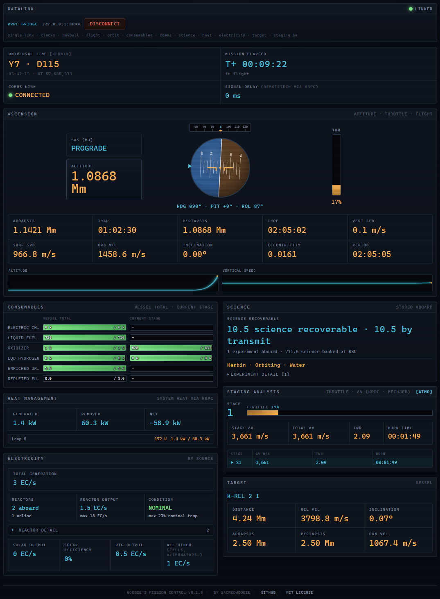
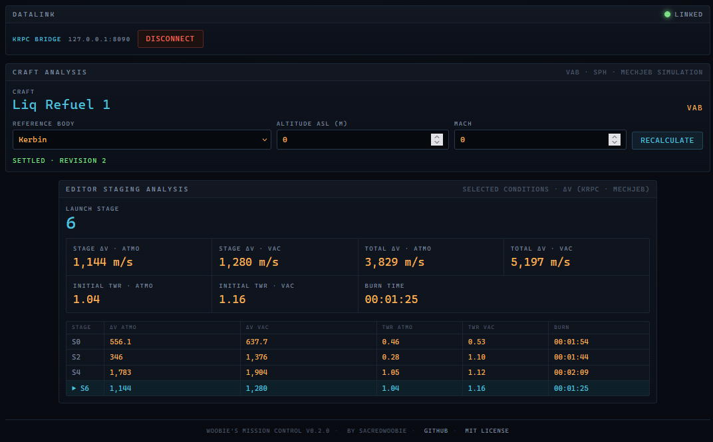
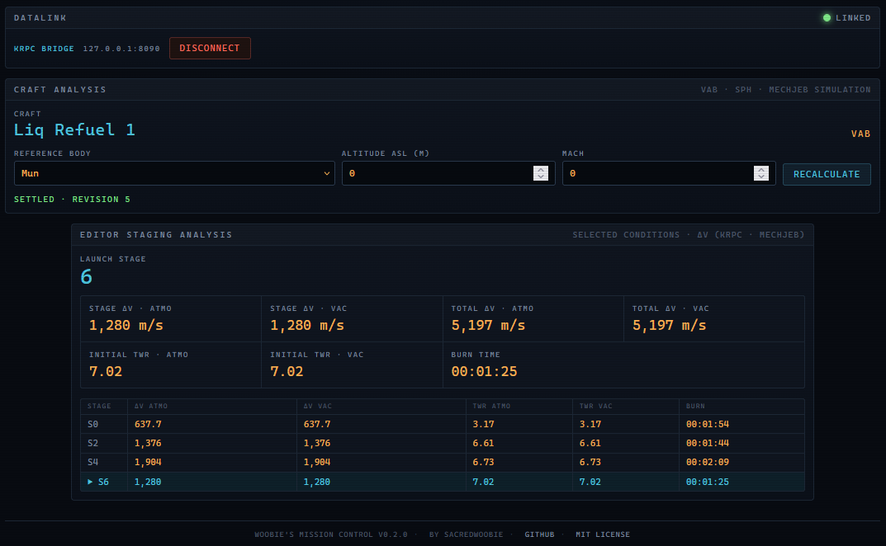
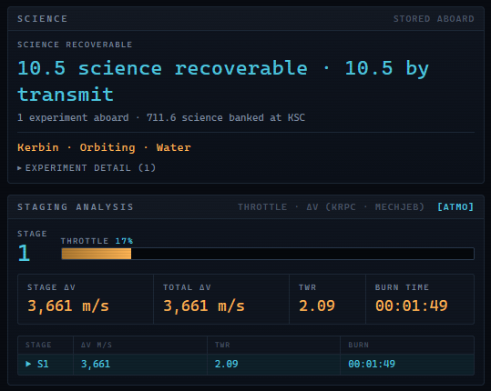
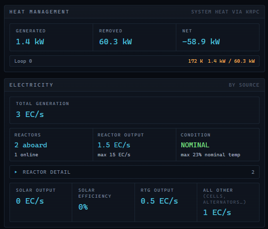
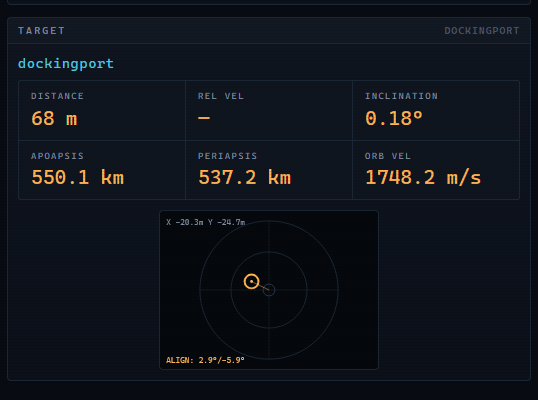
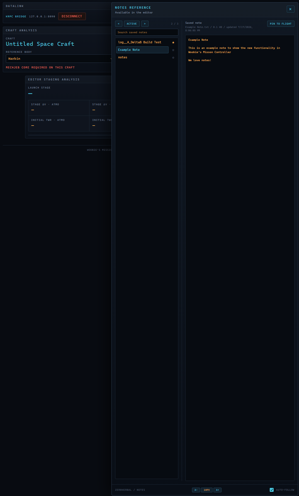
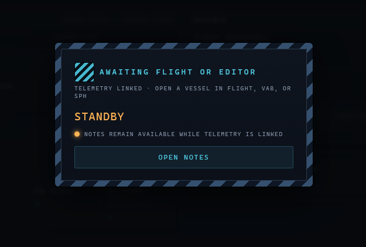
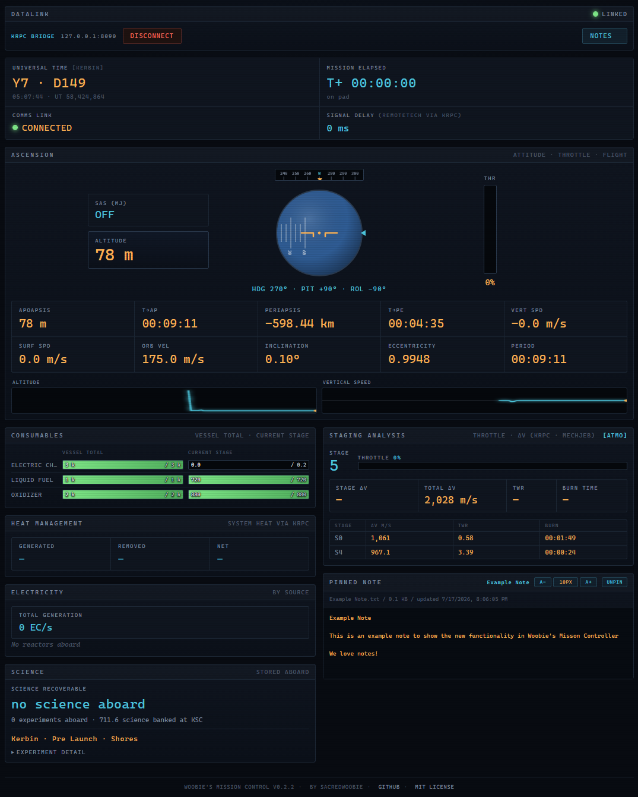

# Woobie's Mission Control

Current release: **v0.2.3**

For the fastest Windows release setup, start with
[`QUICKSTART.txt`](QUICKSTART.txt). It covers the `GameData` copy and automatic
first-run dashboard setup; the full component, compatibility, and
troubleshooting details remain below.

A modular mission dashboard and optional ESP32 control-pad bridge for Kerbal
Space Program 1, powered by [kRPC](https://krpc.github.io/krpc/).

The browser dashboard displays live flight, orbit, resources, communications,
science, thermal, electrical, target, and MechJeb stage-analysis data. When the
optional Notes mod is installed, the active vessel's ship log is available from
an on-demand right-side drawer. The physical control-pad bridge is a separate
process and is not required to use the dashboard.

This is an unofficial community project and is not affiliated with or endorsed
by the developers or publishers of Kerbal Space Program or any supported mod.

## Dashboard preview

<p align="center">
  
</p>

The dashboard is designed for a secondary display and keeps flight, vessel,
and mission-support data visible in one browser window. Sections whose optional
KSP integrations are not installed remain unobtrusive or show unavailable data.

## Components

| Component | Files | Purpose |
| --- | --- | --- |
| Launcher | `Start KSP Dashboard.bat`, `ksp_dashboard_app.py` | Shows controls only for the optional Python components installed beside it. |
| Dashboard | `telemetry_server.py`, `ksp_mission_dashboard.html` | Sends kRPC telemetry to the self-contained browser dashboard. |
| Control pad | `panel_bridge.py` | Connects an ESP32 serial control pad to staging, abort, and the stage-lock indicator. |
| KSP services | Release DLLs installed under `GameData` | Adds System Heat/electricity, MechJeb stage statistics, and stored-science data to kRPC. |

You may install only the pieces you want. For example, if `panel_bridge.py` is
not beside the launcher, the launcher will not show control-pad information or
a control-pad start button.

## Current feature set

- Flight and orbit instruments, navball, throttle, clocks, and sparklines
- Vessel-total and current-stage resources
- MechJeb atmospheric/vacuum delta-v, TWR, and burn-time staging analysis
- VAB/SPH craft planning with selectable body, altitude, and Mach conditions
- Stock CommNet data with optional RemoteTech signal delay
- Recoverable and transmittable science, including science-container contents
- System Heat loop temperatures, generation, rejection, and net heat
- Electrical output by reactor, solar, RTG, and other generation sources
- Target-vessel and docking-alignment information
- Optional read-only Notes browser with active-vessel default, search, cycling,
  favorites, and a pin-to-flight panel
- Optional ESP32 stage/abort control with local arm/safe gates

## Feature tour

### VAB and SPH craft planning



The editor planning view uses MechJeb's simulation while the craft is still in
the VAB or SPH. Select a reference body, altitude above sea level, and Mach to
compare atmospheric and vacuum delta-v and initial TWR for every propulsive
stage. The body list comes from the running game, including installed planet
packs.



On an airless body such as the Mun, the atmospheric and vacuum columns converge
while TWR updates for the body's gravity. This makes it easy to compare launch
and destination performance without leaving the craft editor.

### Science and staging



The science panel totals recoverable and transmittable science aboard the active
vessel, including experiments moved into stock science containers. It also
reports experiment count, biome, situation, and career science already banked
at the KSC. In flight, the staging panel presents a compact atmospheric/vacuum
toggle for delta-v and TWR. In the VAB and SPH, the planning view shows both
conditions side by side and can simulate a selected body, altitude, and Mach.

Stored-science reporting uses `KRPC.VesselScience`. Full staging analysis uses
MechJeb 2, KRPC.MechJeb, and `KRPC.StageStats`.

### Thermal and electrical management



Monitor System Heat generation, rejection, net load, and individual loop
temperature. Electrical reporting separates reactors, solar panels, RTGs, and
other producers such as alternators and fuel cells. The compact reactor summary
shows fleet status at a glance, while its collapsed detail list provides
per-reactor temperature, output, integrity, and fuel information when needed.

These panels use `KRPC.SystemHeat`; the values available depend on the installed
System Heat and electrical-part mods.

### Target and docking alignment



With a vessel or docking port selected as the in-game target, the dashboard
shows distance, relative motion, target orbit, and inclination. For docking-port
targets, the alignment display plots lateral and angular error around a centered
reference so corrections are easy to judge. Confirm the intended target and
controlling docking port in KSP before relying on the display for final contact.

### Notes ship-log drawer

<p align="center">
  <a href="docs/images/v0.2.2-notes/notes-drawer-editor.png">
    
  </a>
</p>

The drawer keeps the saved-note catalog and selected note visible together.
The image is shown as a thumbnail; select it to view the complete layout.

If the optional Notes mod is installed, choose the KSP installation folder in
the Mission Control launcher before starting the dashboard feed. A **Notes**
button appears at the right edge of the dashboard's datalink strip in Flight,
the VAB/SPH, and other connected KSP scenes. In inactive scenes, the standby
overlay also provides an **Open Notes** button.

<p align="center">
  
</p>

The wider drawer keeps a saved-note menu beside the selected note. Search the
catalog, choose any note, or use the previous/next controls to cycle through the
filtered results. Starred notes sort to the top of the menu. In flight,
**Active** returns to the current vessel's log; outside flight, saved notes
remain available even though there is no active-vessel log.

Use **Pin to flight** to place the currently selected note in a scrollable final
panel on the flight dashboard. The pin is independent of the drawer selection,
so you can continue browsing without changing the flight reference. Pinning a
different note replaces the prior pin; **Unpin** removes the panel. Pins last for
the current dashboard-feed session and the panel is shown only in Flight.

<p align="center">
  <a href="docs/images/v0.2.2-notes/notes-pinned-flight-panel.png">
    
  </a>
</p>

The **A-** and **A+** controls adjust text in both the drawer and pinned panel
together from 8 px through 18 px. The existing 10 px size remains the default;
click the displayed size between the buttons to reset it.

Mission Control only reads the Notes text files. It does not edit, create, or
delete notes. The displayed log is limited to its most recent 32 KiB so a large
mission log cannot inflate every telemetry update.

Favorites are dashboard-only metadata stored in
`%LOCALAPPDATA%\WoobiesMissionControl\notes_favorites.json`. Starring a note
does not modify its Notes text file or the Notes mod's configuration.

## Compatibility status

The versions below were used for the v0.2.0 release acceptance pass. Other
versions may work but have not necessarily received the same test coverage.

| Software/mod | Status |
| --- | --- |
| Kerbal Space Program 1 | `1.12.5` |
| Python | `3.14` |
| kRPC KSP mod/server | `0.5.4` |
| Python `krpc` package | `0.5.4` |
| Python `websockets` package | `16.0` |
| Python `pyserial` package | `3.5`, for the ESP32 panel only |
| MechJeb 2 | `2.14.3.0` |
| KRPC.MechJeb | `0.7.1` |
| KRPC.SystemHeat service | `0.2.0` |
| KRPC.StageStats service | `0.2.0` |
| KRPC.VesselScience service | `0.1.0` |
| System Heat | `0.9.1` |
| Near Future Electrical | `2.0.8` |
| Near Future Electrical Core | `2.0.1` |
| Near Future Electrical Decaying RTGs | `2.0.1` |
| Dynamic Battery Storage | `2.3.7.0` |
| RemoteTech | Optional; exposed by base kRPC `0.5.4` |
| Notes | Optional; read-only saved-note browser tested with `0.17.0.0` |

## Installation

### 1. Install the KSP-side dependencies

Install kRPC and the mods required for the dashboard features you plan to use.
Do not copy KSP's own assemblies or third-party mod DLLs from another person's
installation.

The release package contains only this project's three service DLLs:

- `KRPC.SystemHeat.dll`
- `KRPC.StageStats.dll`
- `KRPC.VesselScience.dll`

After starting Mission Control, choose the main KSP installation folder that
contains `GameData`. The launcher's **Mission Control KSP services** panel
compares the packaged and installed DLLs by SHA-256. If a service is missing or
different, close KSP and choose **Install / Repair**. Existing DLLs are backed
up under `%LOCALAPPDATA%\WoobiesMissionControl\dll_backups` before replacement,
and each new copy is verified after installation. The launcher changes only the
three service DLL paths listed above.

Manual copying remains available: copy each provided service folder into your
KSP `GameData` folder. The intended layout uses `KRPC.SystemHeat`,
`KRPC.StageStats`, and `KRPC.VesselScience` as the folder names, with the
matching DLL inside each folder.

The release DLLs are optimized deterministic builds without PDB files or
embedded local build paths.

### 2. Choose your PC-side components

Keep the launcher and whichever components you want in the same normal folder
outside KSP's `GameData` directory.

For the dashboard, keep:

- `Start KSP Dashboard.bat`
- `ksp_dashboard_app.py`
- `telemetry_server.py`
- `ksp_mission_dashboard.html`

For the ESP32 control pad, also keep:

- `panel_bridge.py`
- `firmware/KSP_control.ino` when programming or modifying the panel

### 3. Run the automatic first-time setup

Python 3.14 is required for the current release. Open the folder that contains
`Start KSP Dashboard.bat`:

- In the complete release ZIP, this is the extracted `Dashboard` folder—not the
  package's top-level folder.
- In a source checkout, this is the repository root.

Double-click `Start KSP Dashboard.bat`. On the first run, approve the setup
prompt. The launcher creates `.venv`, installs all dashboard and control-pad
dependencies into that isolated folder, verifies them, and then opens Mission
Control. It does not install, upgrade, or remove packages in the system Python
environment.

If setup is interrupted, run the launcher again. It will reuse and repair the
local environment without requiring Python to be reinstalled. Setup details are
written to `mission_control_setup.log`; review that file before sharing it
because it can contain local paths.

For a read-only diagnostic from Command Prompt, run:

```bat
"Start KSP Dashboard.bat" --check
```

For source development or manual troubleshooting, the equivalent commands are:

```bat
py -3.14 -m venv .venv
.venv\Scripts\python.exe -m pip install -r requirements.txt
```

The component-specific requirements files remain available to developers who
do not want the complete environment.

### 4. Configure the optional Notes integration

To use the Notes drawer, choose the main Kerbal Space Program installation
folder in the launcher's **KSP installation** section. Select the folder that
contains `GameData`, not `GameData` itself. The launcher saves this path under
`%LOCALAPPDATA%\WoobiesMissionControl\settings.json` and passes it only to the
dashboard feed process. A valid installation reports whether the Notes mod was
detected.

You can leave this setting blank when you do not use Notes; every other
dashboard feature continues to work normally.

### 5. Start KSP and the tools

1. Start KSP and enable its kRPC server.
2. Load or launch a vessel.
3. Double-click `Start KSP Dashboard.bat`.
4. Start the dashboard feed, the panel bridge, or both.
5. Starting the dashboard feed opens the dashboard automatically when the HTML
   file is present.

The telemetry server listens only on `127.0.0.1:8090` by default.

## ESP32 control pad

The panel bridge uses a 115200-baud serial connection and recognizes common
CP210x and CH340 USB-to-serial adapters. If more than one candidate device is
connected, set `SERIAL_PORT` near the top of `panel_bridge.py`; the program will
not guess between multiple devices.

Firmware, pin assignments, wiring, debounce behavior, and the serial protocol
are documented in
[`docs/CONTROL_PAD_PROTOCOL.md`](docs/CONTROL_PAD_PROTOCOL.md). The tested
controller is an ESP32-WROOM-32 DevKit V1, selected as `DOIT ESP32 DEVKIT V1`
in Arduino IDE.

## Network and safety notes

- By default, the launcher makes one cached HTTPS request per day to GitHub's
  public Releases API to report whether a newer stable release is available.
  It sends no authentication token or Mission Control telemetry. Automatic
  checks can be disabled in the launcher, and `Check now` remains available.
  Starting a different launcher version bypasses a cached result from the
  previous version and checks immediately when automatic checks are enabled.
  The preference and last successful result are stored under
  `%LOCALAPPDATA%\WoobiesMissionControl` on Windows.
- The launcher shows that version's What's New notes once after an update by
  default. This can be disabled independently in the changelog window, while
  the `Changelog` button remains available for manual viewing.
- Keep the telemetry server bound to `127.0.0.1` unless you intentionally need
  another device on your trusted local network to view it.
- The WebSocket feed is read-only but has no authentication or encryption. Do
  not expose port 8090 to the internet or an untrusted network.
- The ESP32 bridge can stage a vessel and activate the abort action group. Test
  the panel on a disposable craft and verify the arm/safe behavior before using
  it on an important mission.
- Runtime logs such as `launcher_error.log` may include local file paths. They
  are excluded from Git and should not be attached to a public issue without
  reviewing them first.

## Troubleshooting

### The launcher shows no component buttons

Make sure `telemetry_server.py` and/or `panel_bridge.py` is in the same folder as
`ksp_dashboard_app.py`. Only installed components are displayed.

### The launcher could not check for updates

Update checks require internet access to `api.github.com`. A failed check does
not affect Mission Control or its local KSP connection; use `Check now` later or
open the project page from the About dialog.

### The dashboard says it is offline

Confirm that the dashboard feed is running, KSP's kRPC server is enabled, and
no other program is using port 8090.

### A dashboard section is blank

Optional sections require their corresponding KSP mod and service DLL. Missing
optional integrations should leave the relevant section blank without stopping
the rest of the dashboard.

### The Notes button does not appear

In the launcher, choose the main KSP folder that contains `GameData`, then stop
and restart the dashboard feed so it receives the updated location. Confirm the
Notes mod has a `GameData\Notes\Plugins\PluginData\notes` folder (the lowercase
`GameData\notes` variant is also accepted). The button appears in every
connected KSP scene when that folder is available.

If the drawer opens but no active log is shown, create or open the vessel's Ship
Log in Notes. Mission Control matches the active KSP vessel name exactly.

### The ESP32 is not found

Check Windows Device Manager for the control pad's COM port. Set, for example,
`SERIAL_PORT = "COM5"` near the top of `panel_bridge.py`, using the actual port
shown on your computer.

## Known limitations

- Windows is the currently documented launcher platform. The Python scripts can
  run on other platforms, but equivalent launch instructions are not yet tested.
- Docking alignment depends on the vessel's controlling docking port and should
  be validated against the navball before relying on it.
- Compatibility outside the versions listed above remains provisional until it
  receives equivalent clean-package and in-game testing.

## Maintainer release process

The repository includes `tools/Publish-Release.ps1` for assembling and checking
the complete Windows release package. It does not build the three kRPC service
DLLs; run the separate service builder and its release verification first.

The default folder arrangement is:

```text
Documents\
|-- woobies-mission-control\
`-- Woobies-KRPC-Service-Builder\
```

With that arrangement, the script finds the verified DLLs under the sibling
builder's `dist\GameData` folder. A different location can be supplied with
`-GameDataPath`.

From a clean, up-to-date `main` checkout, first create and audit the package
without changing anything on GitHub:

```powershell
powershell.exe -NoProfile -ExecutionPolicy Bypass -File .\tools\Publish-Release.ps1 -Version 0.2.3
```

The script writes the ZIP, SHA-256 checksum, and generated release notes to the
ignored `release-output` folder. Inspect and test that ZIP before continuing.

To let the script create the tag and a **draft** GitHub Release, use a Git clone
of this repository and install [Git for Windows](https://git-scm.com/download/win)
and [GitHub CLI](https://cli.github.com/). They can also be installed from
PowerShell with:

```powershell
winget install --id Git.Git -e
winget install --id GitHub.cli -e
```

Open a new PowerShell window after installation, authenticate once with
`gh auth login`, and then rerun:

```powershell
powershell.exe -NoProfile -ExecutionPolicy Bypass -File .\tools\Publish-Release.ps1 -Version 0.2.3 -CreateDraftRelease
```

The release remains private as a draft until it is reviewed and published on
GitHub. Credentials are managed by GitHub CLI and are never stored in the
repository.

## Contributing and issue reports

When reporting a problem, include the KSP version, installed mod versions,
Python version, the component that was running, and a short sanitized log. Do
not upload save files or logs containing information you do not want public.

## License

This project is released under the MIT License. See [`LICENSE`](LICENSE).

Created by **SacredWoobie**.
