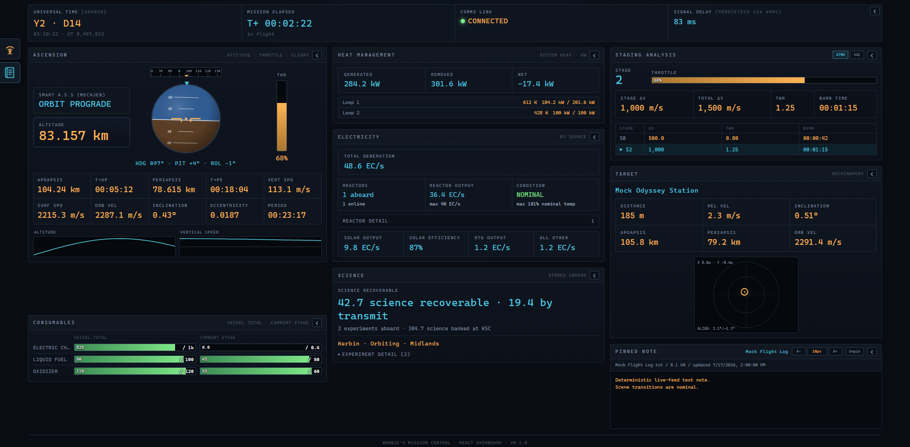
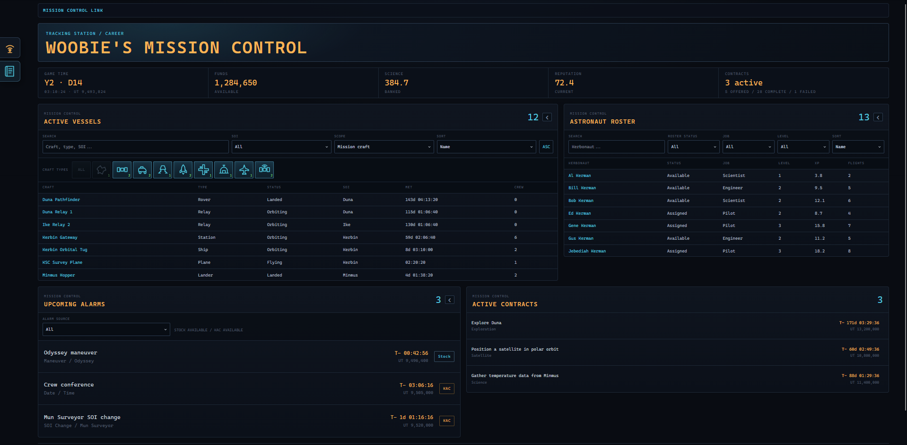
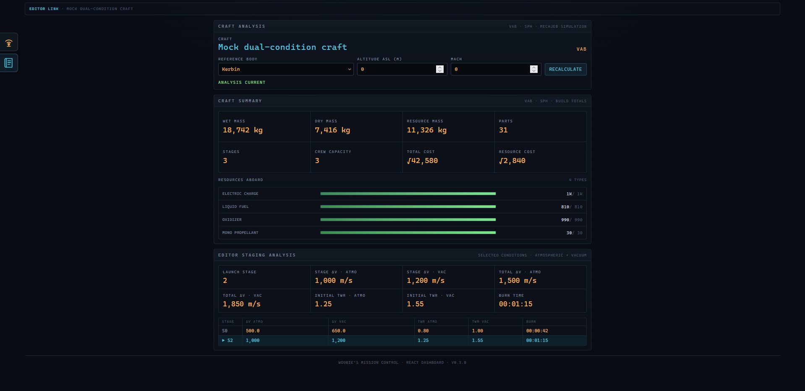
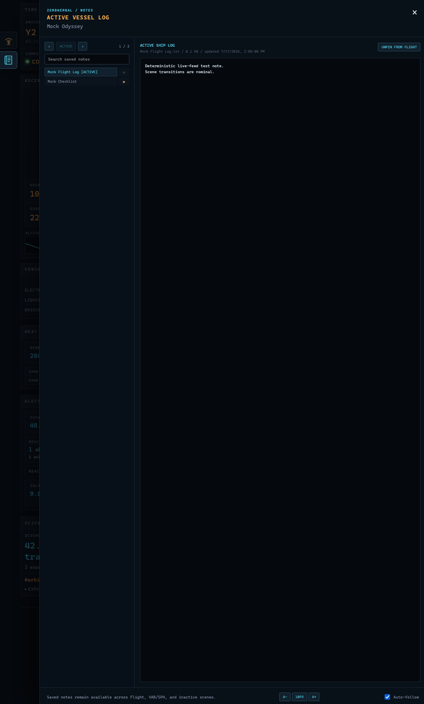
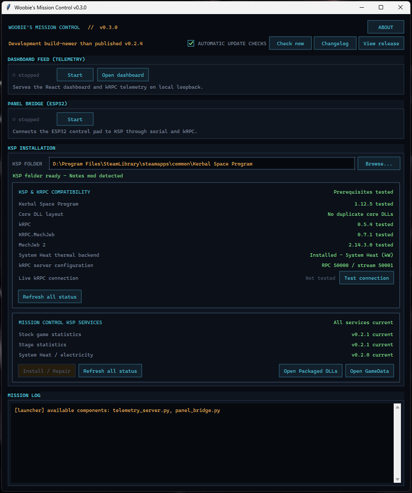

# Woobie's Mission Control

Next release: **v0.3.1**

Current public release: **v0.3.0**

Woobie's Mission Control is a read-only browser dashboard and optional ESP32
control-pad bridge for Kerbal Space Program 1. It uses kRPC for live data and
serves the dashboard only on local loopback at `http://127.0.0.1:8090/`.

The 0.3.0 release replaces the legacy single-file dashboard with a compiled
React/TypeScript interface while retaining the 0.2.4 launcher, compatibility
preflight, service repair, connection test, update/changelog controls, Notes
support, and bounded reconnect behavior. End users do not install Node.js,
Vite, pnpm, or frontend source.

This is an unofficial community project and is not affiliated with or endorsed
by the developers or publishers of Kerbal Space Program or any supported mod.

## Dashboard previews

### Flight

<p align="center">
  <a href="docs/images/v0.3.0/flight-dashboard-landscape.png">
    
  </a>
</p>

The flight workspace fills a normal widescreen monitor while retaining a
responsive portrait stack. Any panel can collapse to its instrument icon on
the left rail and return without resetting the rest of the layout.

### Mission Control

<p align="center">
  <a href="docs/images/v0.3.0/mission-control-landscape.png">
    
  </a>
</p>

Space Center and Tracking Station scenes provide a read-only operational view
of the current save. Vessel, roster, alarm, and contract collections use
separate bounded polling intervals and scroll within the available screen.

### VAB and SPH

<p align="center">
  <a href="docs/images/v0.3.0/editor-vab-landscape.png">
    
  </a>
</p>

Editor telemetry combines the craft's stock build totals with MechJeb staging
analysis. Reference-body, altitude, and Mach changes recalculate after a short
pause, with the manual button retained as a fallback.

## What 0.3.0 includes

- Complete flight dashboard with responsive portrait/landscape layouts and
  persistent icon-based panel collapse/restore controls
- Flight, orbit, navball, resources, science, electrical, thermal, target,
  docking, and MechJeb staging telemetry
- System Heat monitoring in kW, with automatic stock thermal fallback in W
- Read-only Notes drawer and pinned flight note
- VAB/SPH Craft Summary plus debounced body, altitude, and Mach recalculation
- Read-only Mission Control overview for program totals, contracts, active
  vessels, astronaut roster, stock alarms, and Kerbal Alarm Clock alarms
- Multi-select tracked-vessel type filters and sortable/filterable tables
- Optional ESP32 stage/abort control pad

<details>
  <summary>Optional Notes drawer preview</summary>
  <p align="center">
    <a href="docs/images/v0.3.0/notes-drawer.png">
      
    </a>
  </p>
</details>

The three packaged kRPC extensions are independently versioned:

| Service | v0.3.0 selection | Purpose |
| --- | --- | --- |
| WoobiesControlStats | 0.2.1 | Roster, stored science, stock thermal data, and KAC bridge recovery |
| KRPC.StageStats | 0.2.1 | Flight/editor staging and VAB/SPH Craft Summary |
| KRPC.SystemHeat | 0.2.0 | System Heat and electrical integration |

## Installation

Download and extract the complete release, then open its `Dashboard` folder
and double-click `Start KSP Dashboard.bat`.

First run offers four choices using Up/Down and Enter or a typed number:

1. Set up Dashboard and ESP32 Controlpad
2. Set up just Mission Control Dashboard
3. Set up just ESP32 Controlpad
4. Exit

The launcher creates a package-local `.venv` and installs only the chosen
component dependencies. Dashboard-only setup does not install `pyserial`; a
component skipped initially retains a **Set up** button for later.

Choose the main KSP folder containing `GameData`, then use the launcher to
install or repair the three provided services. Existing copies are backed up,
and superseded `KRPC.MissionOverview` and `KRPC.VesselScience` development DLLs
are safely removed during migration.

<details>
  <summary>Launcher and compatibility-preflight preview</summary>
  <p align="center">
    <a href="docs/images/v0.3.0/launcher.png">
      
    </a>
  </p>
</details>

Load a KSP save before testing or starting the feed. kRPC normally stops its
servers at the main menu. The tested endpoints are RPC `50000`, Stream `50001`,
and Mission Control loopback `8090`.

See [`QUICKSTART.txt`](QUICKSTART.txt) for the compact offline walkthrough. The
[project wiki](https://github.com/SacredWoobie/woobies-mission-control/wiki)
contains the full setup, feature, compatibility, and troubleshooting guides.

## Source development

Production runtime source remains at the repository root. React/TypeScript
source lives under `frontend`; fixtures and the Vite controller are developer
only.

```powershell
.\scripts\dashboard-dev.ps1 start
.\scripts\dashboard-dev.ps1 stop
powershell.exe -NoProfile -ExecutionPolicy Bypass -File .\tools\Build-Frontend.ps1 -InstallDependencies -StageRuntimeWeb
python -m unittest discover -s tests -p "test_*.py"
```

Production builds start directly in Live KSP mode and omit fixture data and
the developer drawer. `-StageRuntimeWeb` also copies the verified bundle to the
ignored root `web` folder so the source launcher and telemetry server can be
tested together. Generated dependencies, bundles, logs, runtime web files, and
release staging are excluded by `.gitignore`.

### Populated mock dashboard

Double-click `tools\Mock Mission Control.bat` to open a small control menu for
the production dashboard without running KSP or kRPC. It can hold Flight,
VAB/SPH, or Mission Control data on screen, or cycle through all three every 15
seconds. The mock uses the populated screenshot fixtures, updates flight trends
at 4 Hz, and responds to Editor-condition and Notes commands.

The real dashboard feed must be stopped first because both use the normal
loopback port `8090`. The same controller can be scripted from PowerShell:

```powershell
& ".\tools\Mock Mission Control.bat" start flight
& ".\tools\Mock Mission Control.bat" restart editor
& ".\tools\Mock Mission Control.bat" restart inactive
& ".\tools\Mock Mission Control.bat" restart cycle
& ".\tools\Mock Mission Control.bat" status
& ".\tools\Mock Mission Control.bat" stop
```

Its PID and logs stay under ignored `tools\.mock`. The stop action validates
the saved process identity before terminating anything.

## Release preparation

The release pipeline never rebuilds all service DLLs merely because the
dashboard changed. Each DLL is built and archived separately in the sibling
`Woobies-KRPC-Service-Builder`; its selected release set is combined with a
fresh verified frontend build by `tools/Publish-Release.ps1`.

The package-only command creates both an unpacked acceptance-test folder and a
ZIP without publishing anything:

```powershell
powershell.exe -NoProfile -ExecutionPolicy Bypass -File .\tools\Publish-Release.ps1 -Version 0.3.0
```

See [`docs/RELEASE_PROCESS.md`](docs/RELEASE_PROCESS.md) for service selection,
validation, acceptance testing, and draft-release steps.

## Safety and privacy

- Dashboard and alarm/Notes integrations are read-only.
- The WebSocket feed has no authentication; keep it on `127.0.0.1`.
- The optional ESP32 bridge can stage or abort a vessel. Test its arm/safe
  behavior on a disposable craft first.
- Logs can contain local paths; review them before attaching them publicly.

## License

Released under the [MIT License](LICENSE). Created by **SacredWoobie**.
