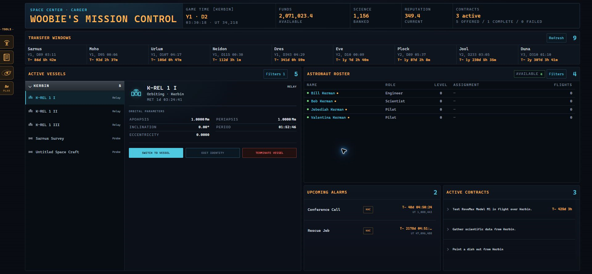
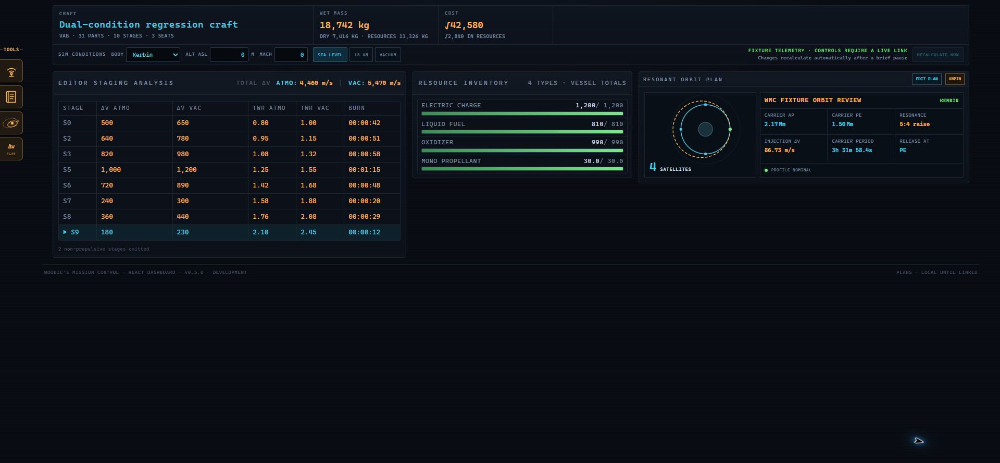
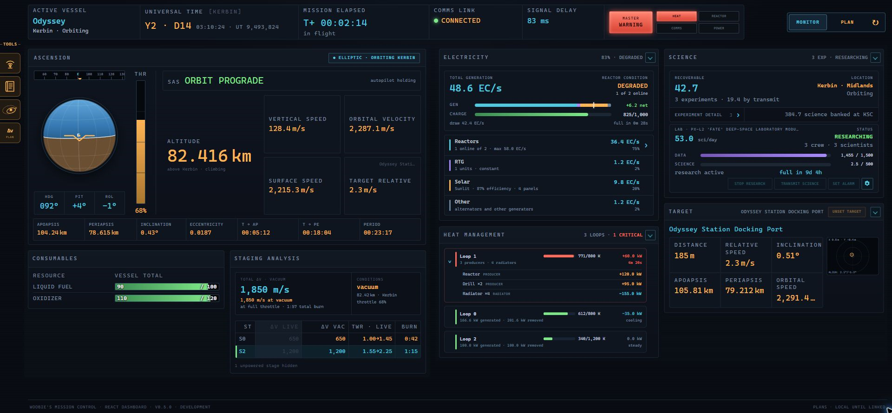

# Woobie's Mission Control

Current public release: **v0.5.0**

Next release candidate: **v0.5.1**

Woobie's Mission Control is a local browser dashboard and mission-planning
workspace for Kerbal Space Program 1. It uses kRPC for live game data and serves
the dashboard from your own computer at `http://127.0.0.1:8090/`. An optional
ESP32 bridge provides physical stage and abort controls.

Version 0.5.1 adds authoritative live contract deadlines, prioritizes a
low-noise countdown in compact contract rows, and moves the absolute KSP due
date into expanded briefings. It also reconciles the dashboard CSS foundation
and adds automated CSS, Python, unit, build, Chrome, and Edge quality gates.

This is an unofficial community project and is not affiliated with or endorsed
by the developers or publishers of Kerbal Space Program or any supported mod.

## A practical second screen for KSP

### Mission Control

<p align="center">
  <a href="docs/images/v0.5.1/space-center-overview.png">
    
  </a>
</p>

At the Space Center and Tracking Station, the dashboard becomes a program
overview. It combines content-weighted program status with transfer windows,
tracked vessels grouped by the current solar-system hierarchy, the astronaut
roster, Stock or Kerbal Alarm Clock alarms, and active contracts. Selecting a
contract opens a readable rail-and-briefing workspace without mixing it into the
alarm list. The fleet briefing brings together useful orbital facts,
roster-backed crew roles, and the next linked event. Guarded actions can switch
to, edit, recover, or terminate the selected vessel, with contextual
confirmation and an explicit warning naming any aboard Kerbals who would be
killed. The body catalog and transfer board support installed planet packs
alongside the stock system.

### Mission planning

<p align="center">
  <a href="docs/images/v0.4.0/resonant-orbit-planner.png">
    
  </a>
</p>

The Resonant Orbit planner works out deployment orbits, orbital periods, and
line-of-sight guidance for evenly spaced constellations. Plans can be saved and
pinned to a craft for use in the VAB or Flight.

<p align="center">
  <a href="docs/images/v0.4.0/delta-v-planner.png">
    
  </a>
</p>

The Delta-V planner builds multi-leg mission budgets from the live KSP body
catalog. Simple mode finds ideal MechJeb transfer dates; Advanced mode adds
per-leg porkchop selection. Saved plans retain their dates, assumptions,
custom allowances, and craft assignment.

### VAB and SPH

<p align="center">
  <a href="docs/images/v0.5.1/editor-craft-analysis.png">
    
  </a>
</p>

The editor view places craft identity, mass, cost, build counts, and simulation
conditions in one overview above MechJeb staging analysis and the resource
inventory. Reference body, altitude, and Mach can be changed directly before
launch. Pinned Mission and Resonant Orbit plans remain compact operational
briefings beside the vehicle, with exact-plan editing when assumptions change.

### Flight

<p align="center">
  <a href="docs/images/v0.5.1/flight-monitor.png">
    
  </a>
</p>

Flight keeps Ascension, Consumables, and Staging Analysis in a persistent
vessel-state region beside switchable MONITOR and PLAN workspaces. Electricity,
heat, science, and target monitoring remain separate from mission and reference
plans, while the software Master Caution surface reports vessel-wide conditions.
Workspace panels collapse in place without losing their state; utility drawers
for Datalink, Notes, and planning tools remain available from the instrument
rail.

For an interplanetary departure, Mission Control can preview one maneuver
against the active orbit and show the resulting burn before anything is changed
in KSP. Creating the node requires a separate confirmation. Mission Control
does not execute nodes, warp, steer, stage, or change throttle.

## Main capabilities

- Saved Delta-V and Resonant Orbit plans that can be assigned to a craft and
  followed through the editor and Flight.
- Live MechJeb transfer calculations, including ideal dates and optional
  porkchop selection.
- Flight engineering for orbit, staging, resources, electrical generation,
  System Heat or stock thermal data, science, targets, and docking.
- Space Center and Tracking Station views with guarded switching to a selected
  vessel.
- VAB/SPH craft totals and atmospheric or vacuum stage simulation.
- Optional Notes, Kerbal Alarm Clock, RemoteTech, System Heat, and ESP32
  integrations without making them requirements for the rest of the dashboard.

## Packaged KSP services

The v0.5.1 release candidate selects four independently versioned kRPC
extensions. Published release packs, including v0.5.0 with
WoobiesControlStats 0.2.6, remain pinned to their original service bytes:

| Service | Selected version | Purpose |
| --- | --- | --- |
| WoobiesControlStats | 0.2.7 | Roster, stored science, research-lab telemetry and controls, stock thermal data, authoritative contract deadlines, KAC bridge recovery, and guarded vessel termination |
| KRPC.StageStats | 0.2.7 | Flight/editor staging, TWR ranges, and VAB/SPH craft totals |
| KRPC.SystemHeat | 0.2.9 | System Heat loops, components, electrical integration, reactor control, and guarded per-loop radiator control |
| KRPC.WoobiesMechJeb | 0.8.6 | MechJeb 2.15.3 staging and transfer-planning bridge |

Historical v0.4.0 and v0.4.1 release packs remain pinned to their published
service bytes and provenance.

## Installation

1. Download and extract the complete release somewhere outside KSP's
   `GameData`. Keep the release's `Dashboard` and `GameData` folders together;
   the launcher installs only the required service folders into KSP.
2. Open `Dashboard` and run `Start KSP Dashboard.bat`.
3. Choose Dashboard, ESP32 Controlpad, or both during first-run setup. The
   launcher creates a package-local Python environment and installs only the
   selected dependencies.
4. Select the main KSP folder—the folder that contains `GameData`—and use
   **Install / Repair** with KSP closed.
5. Start KSP, load a save, confirm kRPC is running, and start the Dashboard
   feed from the launcher.

The launcher backs up replaced Mission Control DLLs and removes superseded
service copies that would otherwise register the same kRPC API twice. Load a
save before testing the connection; kRPC normally stops its servers at KSP's
main menu.

The accepted local endpoints are:

| Purpose | Address or port |
| --- | --- |
| kRPC address | `127.0.0.1` |
| kRPC RPC port | `50000` |
| kRPC stream port | `50001` |
| Mission Control dashboard | `http://127.0.0.1:8090/` |

See [`QUICKSTART.txt`](QUICKSTART.txt) for the compact offline walkthrough. The
[project wiki](https://github.com/SacredWoobie/woobies-mission-control/wiki)
contains the full setup, planning, compatibility, and troubleshooting guides.

## Safety and local data

- Dashboard telemetry, alarms, Notes, overview data, and planning calculations
  stay read-only; switching to an explicitly selected vessel changes the active
  KSP scene but does not alter its controls.
- Overview vessel switching validates the current connection-scoped object ID,
  displayed vessel name, and the KSP vessel GUID when one is available before
  acting.
- Overview vessel edits validate the same live identity plus the displayed
  craft type before changing a name or KSP vessel classification. The contained
  edit dialog locks the surrounding dashboard until it is closed or submitted.
- Vessel recovery and termination validate that identity again along with the
  current recovery state and exact crew roster. Termination is a separate red
  confirmation that lists every aboard Kerbal who will be killed; recovery uses
  KSP's normal green recovery path. Either modal locks the surrounding dashboard
  until it is closed or the request completes.
- Transfer-node creation requires a fresh preview and a second confirmation and
  creates exactly one node.
- Planner records are stored in a shared local Mission Control file so multiple
  dashboard tabs and scenes see the same saved plans.
- The WebSocket feed has no authentication. Keep it on `127.0.0.1`.
- The optional ESP32 bridge can stage or abort a vessel. Test its arm/safe
  behavior on a disposable craft first.
- Logs can contain local paths; review them before posting them publicly.

## Source development

Production Python source lives at the repository root. React and TypeScript
source lives under `frontend`; fixtures, Vite, and the mock server are
development tools rather than end-user dependencies. See
[`CONTRIBUTING.md`](CONTRIBUTING.md) for the complete local and CI checks and
[`docs/DASHBOARD_UI_GUIDELINES.md`](docs/DASHBOARD_UI_GUIDELINES.md) for the
tracked dashboard design contract.

```powershell
.\scripts\dashboard-dev.ps1 start
.\scripts\dashboard-dev.ps1 stop
cd frontend
pnpm install --frozen-lockfile
pnpm check
cd ..
powershell.exe -NoProfile -ExecutionPolicy Bypass -File .\tools\Build-Frontend.ps1 -InstallDependencies -StageRuntimeWeb
.\.venv\Scripts\python.exe -m unittest discover -s tests -p "test_*.py"
```

For repeatable UI work without KSP, `tools\Mock Mission Control.bat` serves the
same production dashboard with populated Flight, VAB/SPH, and Mission Control
telemetry. Stop the real Dashboard feed first because both use port `8090`.

Release assembly is handled by `tools/Publish-Release.ps1`. It builds and tests
the frontend, selects the exact archived service DLLs, verifies licenses and
hashes, and audits the unpacked package and ZIP. See
[`docs/RELEASE_PROCESS.md`](docs/RELEASE_PROCESS.md) for the complete release
procedure.

## License and attribution

Mission Control is released under the [MIT License](LICENSE). Created by
**SacredWoobie**. Bundled and adapted components retain their own licenses and
notices in [THIRD_PARTY_LICENSES.md](THIRD_PARTY_LICENSES.md).

Mission planning is powered in part by
[MechJeb 2](https://github.com/MuMech/MechJeb2), installed separately by the
user. The distributed bridge is Woobie's GPLv3 fork of
[KRPC.MechJeb](https://github.com/Genhis/KRPC.MechJeb); its license, provenance,
and corresponding source are included with each release. This project is not
affiliated with or endorsed by either upstream project.
