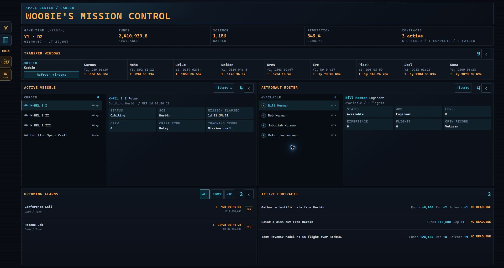
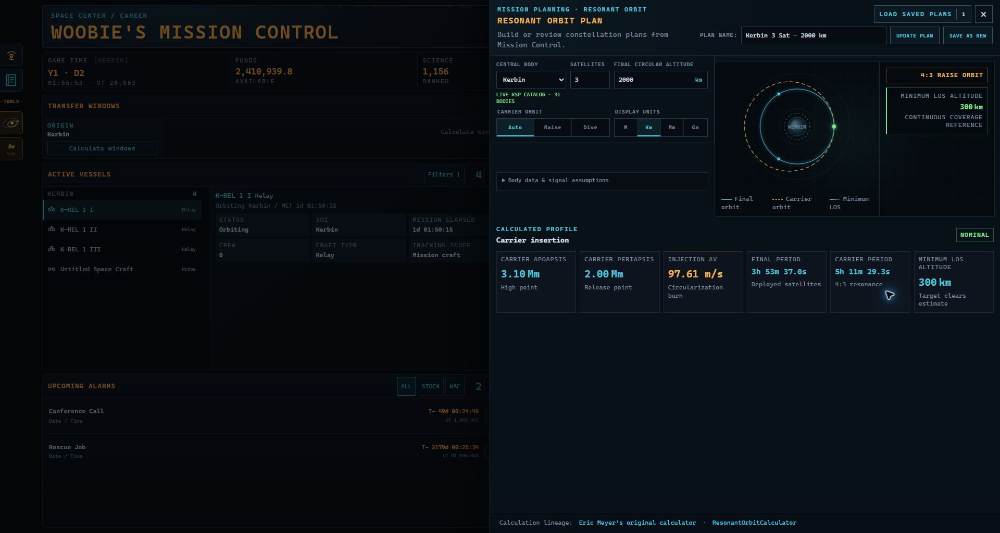
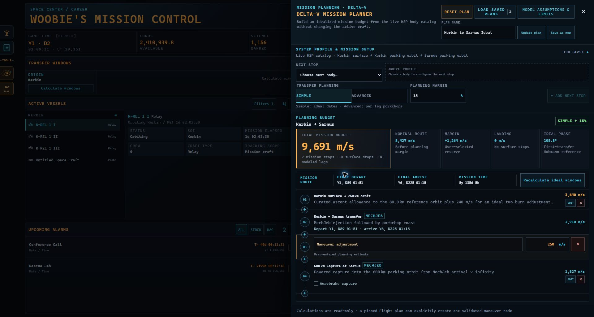
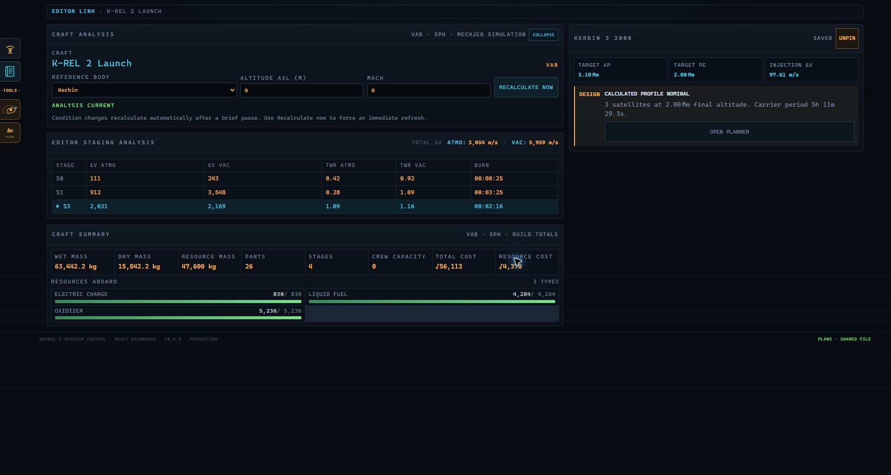
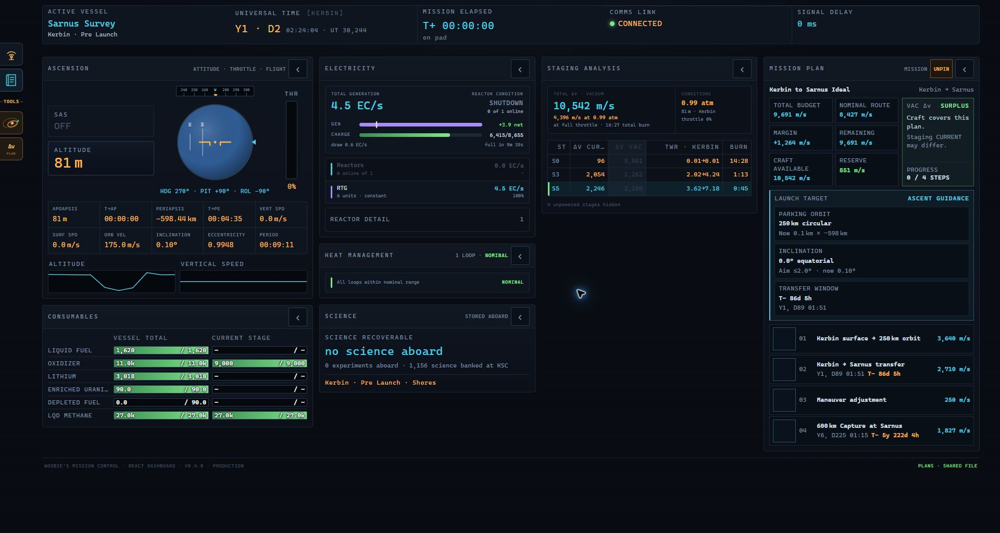

# Woobie's Mission Control

Current release: **v0.4.0**

Woobie's Mission Control is a local browser dashboard and mission-planning
workspace for Kerbal Space Program 1. It uses kRPC for live game data and serves
the dashboard from your own computer at `http://127.0.0.1:8090/`. An optional
ESP32 bridge provides physical stage and abort controls.

Version 0.4.0 brings mission planning into the same interface used for Flight,
the VAB/SPH, and the Space Center. Plans can be saved, assigned to a craft, and
carried from the editor into flight without requiring Node.js or development
tools on the player's computer.

This is an unofficial community project and is not affiliated with or endorsed
by the developers or publishers of Kerbal Space Program or any supported mod.

## A practical second screen for KSP

### Mission Control

<p align="center">
  <a href="docs/images/v0.4.0/space-center-overview.png">
    
  </a>
</p>

At the Space Center and Tracking Station, the dashboard becomes a read-only
program overview. It brings together funds, science, reputation, contracts,
tracked vessels, the astronaut roster, and Stock or Kerbal Alarm Clock alarms.
The transfer-window board uses the current game's body catalog, so supported
planet packs appear alongside the stock system.

### Mission planning

<p align="center">
  <a href="docs/images/v0.4.0/resonant-orbit-planner.png">
    
  </a>
</p>

The Resonant Orbit planner works out deployment orbits, orbital periods, and
line-of-sight guidance for evenly spaced constellations. Plans can be saved and
pinned to a craft for use in the VAB or Flight.

<p align="center">
  <a href="docs/images/v0.4.0/delta-v-planner.png">
    
  </a>
</p>

The Delta-V planner builds multi-leg mission budgets from the live KSP body
catalog. Simple mode finds ideal MechJeb transfer dates; Advanced mode adds
per-leg porkchop selection. Saved plans retain their dates, assumptions,
custom allowances, and craft assignment.

### VAB and SPH

<p align="center">
  <a href="docs/images/v0.4.0/editor-vab-mission-plan.png">
    
  </a>
</p>

The editor view combines stock craft totals with MechJeb staging analysis.
Reference body, altitude, and Mach can be changed before launch, while a pinned
mission plan stays visible beside the vehicle it was designed for.

### Flight

<p align="center">
  <a href="docs/images/v0.4.0/flight-dashboard-mission-planning.png">
    
  </a>
</p>

Flight keeps navigation, orbit, resources, electricity, heat, science, staging,
target, docking, Notes, and mission progress on one responsive screen. Panels
can collapse to the instrument rail and return without disturbing the rest of
the layout.

For an interplanetary departure, Mission Control can preview one maneuver
against the active orbit and show the resulting burn before anything is changed
in KSP. Creating the node requires a separate confirmation. Mission Control
does not execute nodes, warp, steer, stage, or change throttle.

## Main capabilities

- Saved Delta-V and Resonant Orbit plans that can be assigned to a craft and
  followed through the editor and Flight.
- Live MechJeb transfer calculations, including ideal dates and optional
  porkchop selection.
- Flight engineering for orbit, staging, resources, electrical generation,
  System Heat or stock thermal data, science, targets, and docking.
- Read-only Space Center and Tracking Station views for the current save.
- VAB/SPH craft totals and atmospheric or vacuum stage simulation.
- Optional Notes, Kerbal Alarm Clock, RemoteTech, System Heat, and ESP32
  integrations without making them requirements for the rest of the dashboard.

## Packaged KSP services

The release includes four independently versioned kRPC extensions:

| Service | v0.4.0 version | Purpose |
| --- | --- | --- |
| WoobiesControlStats | 0.2.1 | Roster, stored science, stock thermal data, and KAC bridge recovery |
| KRPC.StageStats | 0.2.5 | Flight/editor staging, TWR ranges, and VAB/SPH craft totals |
| KRPC.SystemHeat | 0.2.2 | System Heat loops, components, and electrical integration |
| KRPC.WoobiesMechJeb | 0.8.6 | MechJeb 2.15.3 staging and transfer-planning bridge |

## Installation

1. Download and extract the complete release. Keep its `Dashboard` and
   `GameData` folders together.
2. Open `Dashboard` and run `Start KSP Dashboard.bat`.
3. Choose Dashboard, ESP32 Controlpad, or both during first-run setup. The
   launcher creates a package-local Python environment and installs only the
   selected dependencies.
4. Select the main KSP folder—the folder that contains `GameData`—and use
   **Install / Repair** with KSP closed.
5. Start KSP, load a save, confirm kRPC is running, and start the Dashboard
   feed from the launcher.

The launcher backs up replaced Mission Control DLLs and removes superseded
service copies that would otherwise register the same kRPC API twice. Load a
save before testing the connection; kRPC normally stops its servers at KSP's
main menu.

The accepted local endpoints are:

| Purpose | Address or port |
| --- | --- |
| kRPC address | `127.0.0.1` |
| kRPC RPC port | `50000` |
| kRPC stream port | `50001` |
| Mission Control dashboard | `http://127.0.0.1:8090/` |

See [`QUICKSTART.txt`](QUICKSTART.txt) for the compact offline walkthrough. The
[project wiki](https://github.com/SacredWoobie/woobies-mission-control/wiki)
contains the full setup, planning, compatibility, and troubleshooting guides.

## Safety and local data

- Dashboard telemetry, alarms, Notes, overview data, and planning calculations
  stay read-only.
- Transfer-node creation is the dashboard's only direct KSP write. It requires
  a fresh preview and a second confirmation and creates exactly one node.
- Planner records are stored in a shared local Mission Control file so multiple
  dashboard tabs and scenes see the same saved plans.
- The WebSocket feed has no authentication. Keep it on `127.0.0.1`.
- The optional ESP32 bridge can stage or abort a vessel. Test its arm/safe
  behavior on a disposable craft first.
- Logs can contain local paths; review them before posting them publicly.

## Source development

Production Python source lives at the repository root. React and TypeScript
source lives under `frontend`; fixtures, Vite, and the mock server are
development tools rather than end-user dependencies.

```powershell
.\scripts\dashboard-dev.ps1 start
.\scripts\dashboard-dev.ps1 stop
powershell.exe -NoProfile -ExecutionPolicy Bypass -File .\tools\Build-Frontend.ps1 -InstallDependencies -StageRuntimeWeb
python -m unittest discover -s tests -p "test_*.py"
```

For repeatable UI work without KSP, `tools\Mock Mission Control.bat` serves the
same production dashboard with populated Flight, VAB/SPH, and Mission Control
telemetry. Stop the real Dashboard feed first because both use port `8090`.

Release assembly is handled by `tools/Publish-Release.ps1`. It builds and tests
the frontend, selects the exact archived service DLLs, verifies licenses and
hashes, and audits the unpacked package and ZIP. See
[`docs/RELEASE_PROCESS.md`](docs/RELEASE_PROCESS.md) for the complete release
procedure.

## License and attribution

Mission Control is released under the [MIT License](LICENSE). Created by
**SacredWoobie**. Bundled and adapted components retain their own licenses and
notices in [THIRD_PARTY_LICENSES.md](THIRD_PARTY_LICENSES.md).

Mission planning is powered in part by
[MechJeb 2](https://github.com/MuMech/MechJeb2), installed separately by the
user. The distributed bridge is Woobie's GPLv3 fork of
[KRPC.MechJeb](https://github.com/Genhis/KRPC.MechJeb); its license, provenance,
and corresponding source are included with each release. This project is not
affiliated with or endorsed by either upstream project.
